  

  

 

**AI/ML Engineer & Computer Vision .** Master's student in AI at [EPITA](https://www.epita.fr/) (SCIA Major). I build end-to-end AI systems: not just models, but the pipelines, tooling, and infrastructure around them. From medical image segmentation to world models and LLM engineering, I care about what's happening inside the architecture, not just the benchmark score.

---

## 🚀 Current Work

**[World-Models-Explorer](https://github.com/ryadg-kura/world-models-explorer)** &nbsp;`Python` `PyTorch` `Gymnasium`  
*World Models · Model-Based RL*  
From-scratch RSSM (Recurrent State Space Model) implementation. The model learns compact latent representations of environment dynamics and generates imagined future trajectories without interacting with the real world — core to Dreamer-style model-based RL.

---

## 🔬 Research & Experiments

**[MiniRAG](https://github.com/ryadg-kura/minirag)** &nbsp;`FAISS` `sentence-transformers` `Ollama`  
Minimal RAG pipeline built from scratch — no LangChain, no abstraction layers. FAISS vector store, local embeddings, pluggable LLM backend. Built to understand what's actually happening at each step.

**[SentimentCam](https://github.com/ryadg-kura/sentimentcam)** &nbsp;`OpenCV` `HuggingFace` `MediaPipe`  
Real-time emotion analysis from live video. Face detection pipeline feeds into a transformer-based classifier, with emotion labels and confidence overlaid on the frame. CV meets NLP.

**[TextStyleTransfer](https://github.com/ryadg-kura/textstyletransfer)** &nbsp;`PyTorch` `HuggingFace` `Gradio`  
Fine-tuned GPT-2 for formal ↔ informal style transfer. Includes full training pipeline, BLEU/BERTScore evaluation, and an interactive Gradio demo.

---

## 🛠 Stack

**AI · ML · Vision**

**Web · Backend**

**Systems · Tools**

---

## 📊 Stats

  
  

---

  

---

  📍 Paris, France &nbsp;·&nbsp; EPITA SCIA &nbsp;·&nbsp; Open to research collaborations

